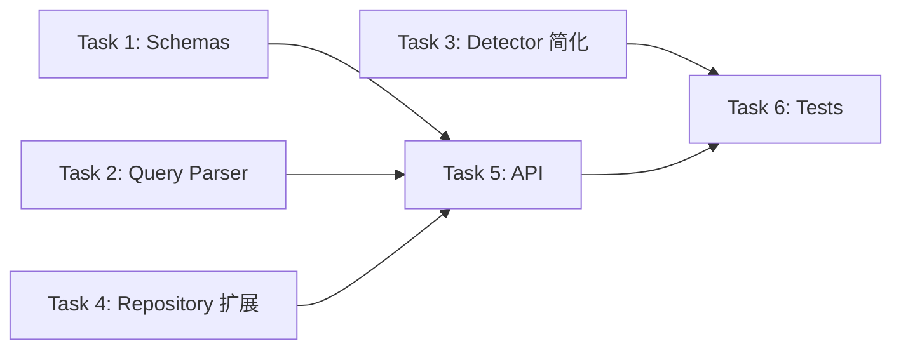

## 任务分解

### 任务依赖关系



- **Task 1-4** 可并行开发（无交叉依赖）
- **Task 5** 依赖 Task 1、2、4
- **Task 6** 依赖 Task 2、3、5

---

### Task 1 — Schemas 定义

**路径**: `backend/app/schemas/query_relation.py`

**交付标准**:
- `QueryRelationRequest` — 含 `sql: str` 字段
- `QueryRelationPreview` — 含 temp_id、source_table、source_columns、target_table、target_columns、join_type、confidence、already_exists
- `QueryRelationResponse` — 含 dialect、queries_parsed、relations 列表、unmatched_tables 列表
- `SaveRelationRequest` — 含 relation_ids 列表
- `SaveRelationResponse` — 含 saved、skipped 计数、relations 详情列表

**依赖**: 无

**验收条件**:
- [ ] 所有模型可实例化，类型正确
- [ ] `QueryRelationRequest` 和 `SaveRelationRequest` 有效 JSON 序列化/反序列化

---

### Task 2 — Query Relation Parser 核心模块

**路径**: `backend/app/query_relation/`（新建目录）
   - `__init__.py`
   - `parser.py` — 核心解析逻辑

**交付标准**:
- `parse_join_relations(sql, tables_dict, dialect) -> tuple[list[DiscoveredRelation], list[str]]`
  - 解析单条/多条 SELECT 语句
  - 提取 LEFT / RIGHT / INNER / CROSS / FULL OUTER JOIN
  - 解析表别名（显式 + 隐式）
  - 提取 ON 条件中的等值字段对（含复合条件 A AND B）
  - 子查询别名跳过
  - SELF JOIN 保留
  - Schema 限定名提取表名
  - 未匹配表名加入 unmatched_tables
- `DiscoveredRelation` dataclass
- 无效 SQL 抛 ValueError 含具体信息

**依赖**: 无（仅使用 sqlglot，已引入）

**验收条件**:
- [ ] 单 LEFT JOIN 正确解析，字段对正确
- [ ] 多表 JOIN（含复合 ON 条件）正确解析
- [ ] 表别名正确映射到真实表名
- [ ] 子查询 `FROM (SELECT ...) AS sub` 被跳过
- [ ] SELF JOIN 被解析为同一表的关系
- [ ] CROSS JOIN 返回空字段对
- [ ] 多条 SQL 语句合并返回
- [ ] 未匹配表名在 unmatched_tables 中
- [ ] 无效 SQL 抛出 ValueError

---

### Task 3 — DDL RelationDetector 简化

**路径**: `backend/app/detector/relation.py`

**交付标准**:
- `detect()` 方法仅保留显式外键转换（原 Step 1）
- 移除 Step 2-4（`_id` 推断、同名字段推断、N:M 中间表标记）
- 移除 `_singularize()` 函数
- 移除 `_make_inferred()` 辅助函数（如果不再被引用）
- 移除 `covered_pairs` 去重集合（步骤 1 无冲突）
- 保留 Step 5 去重逻辑（外键自身可能重复）
- `__init__.py` 中移除 `_singularize` 导出

**依赖**: 无

**验收条件**:
- [ ] `detect()` 只返回 `FOREIGN_KEY` 类型的 relation
- [ ] 自引用外键仍然正确检测
- [ ] 引用不存在的表的外键仍然被忽略
- [ ] `_singularize` 符号已删除
- [ ] `_make_inferred` 符号已删除

---

### Task 4 — Repository 扩展

**路径**: `backend/app/store/repository.py`

**交付标准**:
- `relation_exists(project_id, source_table_id, target_table_id, source_columns, target_columns) -> bool` — 检查完全相同的 relation 是否已存在
- `save_query_relations(project_id, relations: list[RelationData]) -> list[Relation]` — 增量追加写入（不删除已有 relations）

**依赖**: Task 1（可先定义 RelationData 对齐）

**验收条件**:
- [ ] `relation_exists` 对重复关系返回 True
- [ ] `relation_exists` 对不存在关系返回 False
- [ ] `save_query_relations` 追加写入，不影响已有记录

---

### Task 5 — API 端点 + 路由注册

**路径**:
- `backend/app/api/query_relations.py`（新建）
- `backend/app/main.py`（修改）

**交付标准**:

**`POST /api/projects/{id}/query-relations`**
1. 校验项目存在（404）
2. 获取项目表字典
3. 调用 `parse_join_relations()`
4. 匹配已存在的关系（`relation_exists`）
5. 返回 `QueryRelationResponse`

**`POST /api/projects/{id}/query-relations/save`**
1. 校验项目存在（404）
2. 校验 relation_ids 有效（400）
3. 重新解析 SQL（由请求体中的 sql 或缓存提供）
4. 过滤用户选择的 relation → 去重 → 批量写入
5. 返回 `SaveRelationResponse`

**注册**:
- `app/main.py` 中添加 `app.include_router(query_relations_router)`

**依赖**: Task 1、2、4

**验收条件**:
- [ ] `POST /api/projects/{id}/query-relations` 返回正确的预览结果
- [ ] 已存在关系标记 `already_exists: true`
- [ ] 无效 project_id 返回 404
- [ ] 无效 SQL 返回 400
- [ ] `POST /api/projects/{id}/query-relations/save` 正确持久化
- [ ] 重复保存（相同 relation）自动跳过，不报错
- [ ] 写入后可通过 GET /api/relations 查询到

---

### Task 6 — 测试

**路径**:
- `backend/tests/test_query_relation_parser.py`（新建）
- `backend/tests/test_api_query_relations.py`（新建）
- `backend/tests/test_detector.py`（修改）

**交付标准**:

**Parser 单元测试**（test_query_relation_parser.py）:
- 各种 JOIN 类型解析
- 别名解析
- 复合 ON 条件
- 子查询跳过
- SELF JOIN
- 无效 SQL
- 多条语句

**Detector 测试更新**（test_detector.py）:
- 删除 `test_id_suffix_exact_match`、`test_id_suffix_plural_match`、`test_same_name_same_type_inference`、`test_nm_bridge_table_marking`
- 删除 `TestSingularize` 类
- 保留并确认 `test_explicit_fk_detection`、`test_self_referencing_fk`、`test_no_relation_for_missing_target`
- 修改 `test_dedup_keeps_highest_confidence` 以适应简化逻辑

**API 集成测试**（test_api_query_relations.py）:
- 预览端点正常流程
- 保存端点正常流程
- 完整流程：预览 → 选择 → 保存 → 验证
- 错误路径（项目不存在、无效 SQL、无效 temp_id）

**依赖**: Task 2、3、5

**验收条件**:
- [ ] Parser 测试全部通过
- [ ] Detector 测试全部通过（仅含外键相关用例）
- [ ] API 集成测试全部通过
- [ ] `_singularize`、`_make_inferred` 等已移除符号无残留引用

---

## 执行顺序建议

```
Round 1: Task 1 (Schemas) + Task 2 (Parser) + Task 3 (Detector) — 并行
Round 2: Task 4 (Repository) + Task 5 (API) — 串行
Round 3: Task 6 (Tests) — 全部完成后统一验证
```
