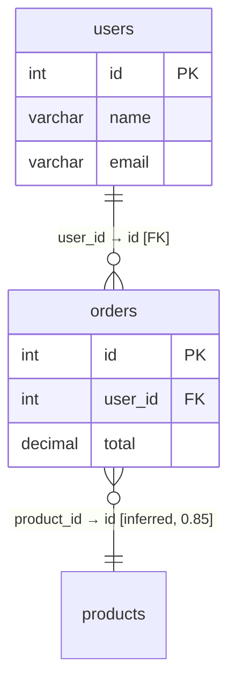

## 摘要

在 Phase 1 解析引擎的基础上，实现元数据持久化存储、关系检测（显式外键 + 隐式推断）和 ER 图可视化数据接口，使用户能够上传 DDL 后获得完整的表关系图谱和 Mermaid ER 图导出能力。

## 动机

Phase 1 已实现 DDL 文本 → 结构化元数据的解析能力，但解析结果无法持久化，也无法自动发现表之间的关联关系。用户上传 DDL 后只能看到孤立的表列表，无法理解数据流向和表间关联。Phase 2 填补这一断层：

- **Metadata Store** 将解析结果持久化，提供 CRUD API，成为所有上层模块的数据中枢
- **Relation Detector** 自动发现显式外键和隐式关联，输出带置信度的关系图谱
- **Visualization** 提供 graph API（nodes + edges），支持前端渲染 ER 图和 Mermaid 导出

## 范围

### 包含

**Metadata Store（P0）**
- SQLite 数据库 + SQLAlchemy ORM，自动建表迁移
- 项目 CRUD：创建、列表、详情、删除（级联删除关联数据）
- DDL 上传 → 解析 → 事务性写入，解析失败全部回滚
- 表/字段/索引/外键/关系的查询 API

**Relation Detector（P0-P1）**
- 显式外键 → Relation 转换（confidence = 1.0）
- `_id` 后缀命名推断：`user_id` → `users.id`（confidence = 0.85）
- 同名字段同类型推断（confidence = 0.60）
- N:M 中间表识别：恰好 2 个外键 + ≤5 列的表中无额外业务字段
- 关系去重：同一对 (source_table, target_table, columns) 不重复
- 循环引用检测与环路径标记

**Visualization（P0-P1）**
- `GET /api/projects/{id}/graph` — 返回 nodes + edges 结构，前端可直接消费
- `GET /api/projects/{id}/mermaid` — 返回 Mermaid ER 图语法文本
- 节点包含：表名、schema、字段列表（标注 PK/FK）、注释
- 连线区分：实线（FOREIGN_KEY）、虚线（INFERRED），附带置信度
- 关系筛选：按类型/置信度阈值过滤

### 不包含

- AI 辅助关系推断（Phase 3）
- 前端交互式 ER 图渲染（Phase 2 仅提供数据接口 + Mermaid 导出）
- 自然语言查询、文档生成（Phase 3）
- 版本对比、多文件管理（Phase 4）
- 用户认证与权限
- ENUM 值解析、CHECK 约束等 P1/P2 解析特性（后续提案）

### 依赖

- PRD: `prd/02-store-module.md`、`prd/03-relation-detector.md`、`prd/04-visualization.md`
- 内部依赖：Phase 1 解析引擎（`app/parser/`）— 已完成
- 第三方库：SQLAlchemy、aiosqlite

## 规范

### 数据模型

基于 PRD 02 简化，聚焦 Phase 2 必需字段：

**Project**
| 字段 | 类型 | 说明 |
|------|------|------|
| id | UUID PK | |
| name | str | 项目名称 |
| description | str? | |
| dialect | str | mysql / postgresql / sqlite |
| created_at | datetime | |
| updated_at | datetime | |

**Table**
| 字段 | 类型 | 说明 |
|------|------|------|
| id | UUID PK | |
| project_id | FK → Project | |
| schema_name | str | 默认空字符串 |
| name | str | 表名 |
| comment | str? | |
| created_at | datetime | |

**Column**
| 字段 | 类型 | 说明 |
|------|------|------|
| id | UUID PK | |
| table_id | FK → Table | |
| name | str | |
| ordinal_position | int | 字段顺序 |
| data_type | str | |
| length | int? | |
| nullable | bool | |
| default_value | str? | |
| is_primary_key | bool | |
| comment | str? | |

**Index**
| 字段 | 类型 | 说明 |
|------|------|------|
| id | UUID PK | |
| table_id | FK → Table | |
| name | str | |
| unique | bool | |
| columns | JSON | ["col1", "col2"] |

**ForeignKey**
| 字段 | 类型 | 说明 |
|------|------|------|
| id | UUID PK | |
| table_id | FK → Table | |
| columns | JSON | ["dept_id"] |
| ref_table_name | str | 引用表名（解析时可能尚未持久化） |
| ref_columns | JSON | ["id"] |
| constraint_name | str? | |

**Relation**
| 字段 | 类型 | 说明 |
|------|------|------|
| id | UUID PK | |
| project_id | FK → Project | |
| source_table_id | FK → Table | |
| source_columns | JSON | |
| target_table_id | FK → Table | |
| target_columns | JSON | |
| relation_type | enum | FOREIGN_KEY / INFERRED |
| confidence | float | 0.0 ~ 1.0 |
| source | str? | 来源说明 |

### API 设计

| 方法 | 路径 | 说明 |
|------|------|------|
| POST | /api/projects | 创建项目 |
| GET | /api/projects | 项目列表（分页） |
| GET | /api/projects/{id} | 项目详情 + 统计 |
| DELETE | /api/projects/{id} | 删除项目（级联） |
| POST | /api/projects/{id}/upload | 上传 SQL → 解析 → 持久化 |
| GET | /api/projects/{id}/tables | 表列表 |
| GET | /api/projects/{id}/tables/{tid} | 表详情（含字段+索引+外键） |
| GET | /api/projects/{id}/relations | 关系列表（支持类型/置信度筛选） |
| GET | /api/projects/{id}/graph | 图数据（nodes + edges） |
| GET | /api/projects/{id}/mermaid | Mermaid ER 图文本 |

### 关系推断规则

按优先级依次执行：

1. **显式外键** → 查找 ForeignKey 记录，匹配 ref_table_name → Table.name，生成 FOREIGN_KEY 关系（confidence=1.0）
2. **`_id` 后缀推断** → 遍历所有 `_id` 结尾的字段，将前缀与项目中其他表名匹配（支持单复数模糊），生成 INFERRED 关系（confidence=0.85 精确匹配 / 0.70 模糊匹配）
3. **同名字段推断** → 两张不同表中同名、同类型的字段（非主键），生成 INFERRED 关系（confidence=0.60）
4. **N:M 中间表识别** → 满足以下条件的表标记为中间表：字段数 ≤ 5、恰好含 2 个外键、这 2 个外键的目标表已建立关系
5. **去重** → 同一对 (source_table, source_columns, target_table, target_columns) 只保留最高置信度的一条

### Mermaid ER 图格式

- 外键关系用 `||--o{` 表示（1:N）
- 推断关系用虚线样式（Mermaid 不原生支持虚线，通过注释标注 `[inferred]` 区分）
- 每个节点内只展示字段名+类型+PK/FK 标记

### 错误处理

| 场景 | 行为 |
|------|------|
| 项目不存在 | 返回 404 |
| 上传空 SQL | 返回 400 + 错误信息 |
| 解析全部失败（无有效表） | 返回 422 + 解析错误列表，不写入数据库 |
| 并发上传同一项目 | SQLite 写锁串行化，后到达的请求返回 409 |
| DDL 中引用尚未创建的表 | 先存储 ForeignKey，Relation 推断在全部表写入后执行 |

## 验收标准

- [ ] 项目 CRUD 全部可用，级联删除正确
- [ ] 上传 DDL → 解析 → 持久化 → 查询，数据完整无丢失
- [ ] 解析失败时无脏数据残留（事务回滚）
- [ ] 显式外键 100% 转换为 Relation
- [ ] `_id` 命名推断准确率 > 90%（基于标准测试集）
- [ ] N:M 中间表 100% 识别
- [ ] 关系去重正确，同一对表不出现重复条目
- [ ] GET /graph 返回结构符合 vis-network / D3.js 消费格式
- [ ] GET /mermaid 返回可渲染的有效 Mermaid ER 语法
- [ ] 单元测试覆盖率 > 85%
- [ ] 200 张表的项目关系推断耗时 < 2s

## 备注

- Phase 2 不包含前端渲染，仅提供后端数据接口和 Mermaid 文本导出
- Metadata Store 使用 SQLite（开发环境），数据库文件存储在 `backend/data/` 目录
- 表名匹配支持常见英文复数形式（s/es/ies 等），不引入第三方 NLP 库
